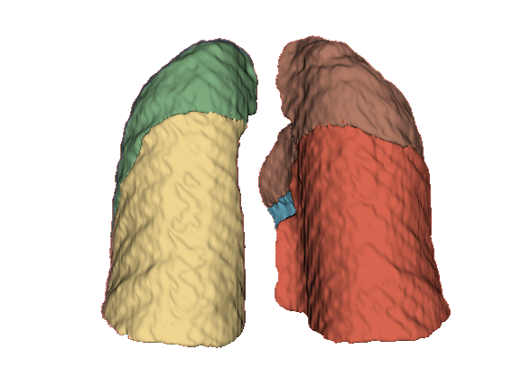
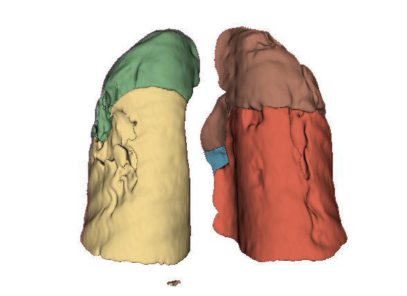
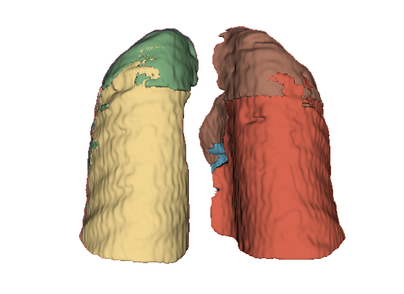

# LobePrior: Segmenting Lung Lobes on Computed Tomography Images in the Presence of Severe Abnormalities

Initial project presented at the XXIX Congresso Brasileiro de Engenharia Biomédica (CBEB) 2024 (https://sbeb.org.br/cbeb2024)

> Deep learning with probabilistic models for segmenting lung lobes on computed tomography images with severe abnormalities

## Abstract

> The development of efficient and robust algorithms for lung and lobe segmentation is essential for diagnosing and monitoring pulmonary diseases, such as pneumonia caused by COVID-19 and lung cancer. However, obtaining manual or automatic annotations of lung lobes is challenging, especially in patients with severe pulmonary abnormalities due to the difficulty of visualizing the lobar fissures. This work aims to provide an automated lung lobe segmentation method using deep neural networks and probabilistic models, called LobePrior. Segmentation is performed in three stages: a coarse stage that processes images with reduced resolution; a high-resolution stage, in which specialized AttUNets compete for the segmentation of each lung lobe; and a final stage where post-processing is applied to the segmented lobes. Probabilistic models, constructed from label fusion, are used to guide the model in regions where severe abnormalities have caused segmentation failures. The performance of the proposed approach was evaluated on LOLA11 (Grand Challenge) and four datasets with manual lobe annotations, in the presence of cancerous nodules and COVID-19 consolidations. Qualitative and quantitative results demonstrate that LobePrior achieved more accurate segmentations, closely matching the reference segmentation. All these results, when compared to other approaches, indicate that the LobePrior method achieved superior performance in lung lobe segmentation. The method has been incorporated into a tool developed by the MICLab group, called MEDPSeg, available on GitHub at [MEDPSeg](https://github.com/MICLab-Unicamp/medpseg).

## To install  Miniconda and dependencies

This tool was tested on Ubuntu 20.04. The following instructions refer to quickly running the tool by installing it with Miniconda and pip. The minimum recommended GPU memory is 12 GB for inference and 24 GB for training. The required dependencies are installed during setup and are listed in the requirements.txt file.  

It is recommended to create a dedicated environment to run the LobePrior method to avoid interference with your current environment. To install Miniconda on Linux, follow the instructions available at: [Miniconda](https://docs.conda.io/en/latest/miniconda.html).

To create a Miniconda environment named lobeprior, run:

> conda create -n lobeprior python=3.8

To activate the lobeprior environment and install the required packages:

> conda activate lobeprior

> pip install -r requirements.txt

## Installation

First, clone the repository:

> git clone https://github.com/MICLab-Unicamp/LobePrior

Due to the large size of network weights, you need to go into the Releases in this repository, download the data.zip file, and put it inside the medpseg folder. This can be done through the command line with:

> cd LobePrior

> wget https://github.com/MICLab-Unicamp/LobePrior/releases/download/LobePrior/data.zip

If this method of downloading the weights doesn't work for you, use this alternative link [Data](https://github.com/MICLab-Unicamp/LobePrior/releases/download/LobePrior/data.zip). The names of the folders and files must not be changed.

Extract the .ckpt files inside the LobePrior/weight folder and raw_images inside the LobePrior folder.

> unzip data.zip

Finally, go into the top level folder, inside LobePrior folder.

<div align="center">
	<figure>
	    
	</figure>
</div>

## To predict lung lobe segmentation from an image with probabilistic templates

> python predict.py -i input -o output

## To predict lung lobe segmentation from an image without probabilistic templates

> python predict.py -i input -o output -n

## Images for testing

If you wish to test the LobePrior method, you may use a public dataset referred to here as CoronaCases. The COVID-19 CT Lung and Infection Segmentation Dataset, available on Zenodo, provides 20 computed tomography (CT) scans of COVID-19 patients. You can access and download the dataset directly via the following link:

[CoronaCases](https://zenodo.org/records/3757476)

<!--
We present an approach using probabilistic models, constructed from lung CT images. The images were recorded and separated into groups, according to shape and appearance. The images were separated into groups because of the great difference between the shapes that the lung has between patients. Added to post-processing and templates, a model capable of segmenting CT images of lungs affected by severe diseases was developed. The main contribution of this work was to improve the quality of these segmentations and present a model capable of identifying lobar fissures more efficiently, as this is a task considered very difficult, overcoming the difficulty of the methods in finding the fissures correctly, as they are healthy. deformed by lung diseases such as cancer and COVID-19.
-->

# Project

   * This work was accepted in CBEB 2024 (https://sbeb.org.br/cbeb2024).

   <div align="center">
	<figure>
	    
	</figure>
   </div>

* Diagram of the method implemented using CCN and a priori information, incorporated into the network input as probabilistic models:

     <div align="center">
	<figure>
	    
	</figure>
     </div>


* Segmentations using the LobePrior, nnUnet and LungMask methods on the CT image coronacases_007 (slice 150), from the Coronacases[1] dataset. Here, it is possible to visualize the segmentation errors (rectangular region) generated by each of the networks, in relation to the \textit{gold standard} (Fig. b):

   <div align="center">
	<figure>
	    
		</td>
		<br>CT image and Ground Truth<br>
	</figure/figure>

	<br>

	<figure>
		
		
		
		<br>LobePrior (Dice score = 0.979), nnUnet (Dice score = 0.943) and Lungmask (Dice score = 0.945)<br>
	</figure>
   </div>


* Qualitative evaluation using 3D representations in CT images of lungs from patients with severe injuries:

   <div align="center">
	<figure>
	    
	</figure>
   </div>

* Qualitative evaluation using 3D representations in CT images of lungs from patients with severe injuries:

   <div align="center">
	<figure>
	    
	</figure>
   </div>


<div align="center">
	<figure>
		
		
	    	
	</figure>
</div>

<!--
Outputs for LobePrior       |  Outputs for nnUnet    |  Outputs for Lungmask
:-------------------------:|:-------------------------:
  |
   |

-->


## Citation

``` 
@DATASET{redu_ORXJKS_2025,
	author = {Jean Antonio Ribeiro and Leticia Rittner and Diedre Santos do Carmo and Simone Appenzeller and Ricardo Siufi Magalhães and Sergio San Juan Dertkigil and Fabiano Reis},
	publisher = {Repositório de Dados de Pesquisa da Unicamp},
	title = {{LOCCA: Manual annotations for lung lobes in CT images of patients with cancer and COVID-19}},
	year = {2025},
	version = {V1},
	doi = {10.25824/redu/ORXJKS},
	url = {https://doi.org/10.25824/redu/ORXJKS}
}

@ARTICLE{CBEB2024,
	title = {Deep learning with probabilistic models for segmenting lung lobes on computed tomography images with severe abnormalities},
	journal = {CBEB 2024},
	pages = {1-6},
	year = {2024},
	author = {Jean Antonio Ribeiro and Diedre Santos do Carmo and Fabiano Reis and Leticia Rittner}
}

@ARTICLE{review2022,
	title = {{A Systematic Review of Automated Segmentation Methods and Public Datasets for the Lung and its Lobes and Findings on Computed Tomography Images}},
	author={Diedre Santos do Carmo and Jean Antonio Ribeiro and Sergio Dertkigil and Simone Appenzeller and Roberto Lotufo and Leticia Rittner},
	journal={Yearbook of Medical Informatics},
	volume={31},
	number={01},
	pages={277-295},
	year={2022},
	doi = {10.1055/s-0042-1742517}
}
```
